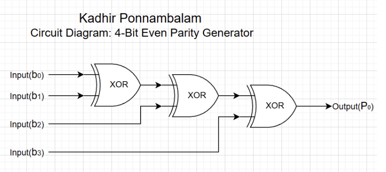
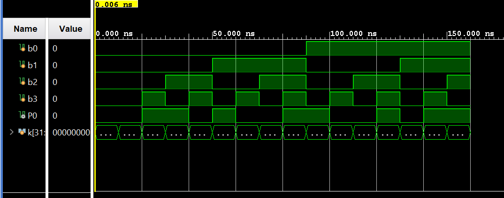

# 4-Bit Even Parity Generator

A Verilog implementation of a 4-bit even parity generator, developed in Vivado IDE. This document provides theory, derivations, and simulation results for the circuit.

---

## Table of Contents

- [What Is a 4-Bit Even Parity Generator?](#what-is-a-4-bit-even-parity-generator)
- [Learning Resources](#learning-resources)
- [Running the Project in Vivado](#running-the-project-in-vivado)
- [Truth Table](#truth-table)
- [K-Map](#k-map)
- [Simplified Boolean Equation](#simplified-boolean-equation)
- [XOR and XNOR Gates](#xor-and-xnor-gates)
- [Circuit Diagram](#circuit-diagram)
- [Waveform Diagram](#waveform-diagram)
- [Testbench Output](#testbench-output)

---

## What Is a 4-Bit Even Parity Generator?

A **parity bit** is an extra bit added to a word or data stream for **error detection**. It does not carry data; it only encodes whether the number of 1’s in the data (plus the parity bit itself) is odd or even.

- **Odd parity:** The total number of 1’s in the code **including the parity bit** must be **odd**.
- **Even parity:** The total number of 1’s in the code **including the parity bit** must be **even**.

A **4-bit even parity generator** takes four data bits (b₀, b₁, b₂, b₃) and produces a single parity bit **P₀** so that the total count of 1’s in (b₀, b₁, b₂, b₃, P₀) is even. Thus, P₀ is 1 when the number of 1’s in the four inputs is odd, and 0 when that count is even. This allows a receiver to check for single-bit errors by verifying that the total number of 1’s (data + parity) remains even.

---

## Learning Resources

Useful online resources for parity, logic gates, and digital design:

| Resource | Description |
|----------|-------------|
| [Parity Generator and Parity Checker (YouTube)](https://www.youtube.com/results?search_query=parity+generator+and+parity+checker) | Search for “parity generator and parity checker” to find step-by-step explanations. |
| [Logic Gates – AND, OR, NOT, XOR, XNOR (YouTube)](https://www.youtube.com/results?search_query=logic+gates+XOR+XNOR) | Search for “logic gates XOR XNOR” for gate behavior and truth tables. |
| [Digital Electronics – Parity (YouTube)](https://www.youtube.com/results?search_query=digital+electronics+parity) | Search for “digital electronics parity” for parity in the context of digital systems. |
| [K-Map Simplification (YouTube)](https://www.youtube.com/results?search_query=karnaugh+map+simplification) | Search for “Karnaugh map simplification” to see how the parity expression is derived. |

---

## Running the Project in Vivado

Follow these steps to create a Vivado project, add the design and testbench, and run simulation.

### 1. Create a new project

1. Launch **Vivado** (e.g., Vivado HLx or Vivado ML Edition).
2. Click **Create Project** (or **File → Project → New**).
3. Click **Next**, choose a project name and location, then **Next**.
4. Select **RTL Project** and leave "Do not specify sources at this time" unchecked if you want to add sources in the next step, or check it and add sources later. Click **Next**.
5. For **Default Part**, pick any FPGA part (e.g., a Xilinx Artix-7 or your board's part). For simulation-only you can choose any part. Click **Next**, then **Finish**.

### 2. Add design and testbench sources

1. In the **Flow Navigator**, under **Project Manager**, click **Add Sources** (or **File → Add Sources**).
2. Choose **Add or create design sources**, click **Add Files**, and add:
   - `EvenParityGenerator.v`
3. Click **Add or create simulation sources**, click **Add Files**, and add:
   - `ParityGenerator_tb.v`
4. Click **OK** and **Finish**. Ensure the testbench is set as a simulation-only source (not as a design source).

### 3. Run behavioral simulation

1. In the **Flow Navigator**, under **Simulation**, click **Run Behavioral Simulation** (or **Flow → Run Simulation → Run Behavioral Simulation**).
2. Vivado will compile the design and testbench and open the **Simulation** tab with the waveform.
3. Use the waveform to verify that the parity output **P₀** matches the [Truth Table](#truth-table) for all 16 input combinations of b₀–b₃.

### 4. (Optional) Run synthesis and implementation

To synthesize and implement for an FPGA:

1. Under **Flow Navigator**, click **Run Synthesis**, then **Run Implementation**, then **Generate Bitstream** (if you need a bitstream for your board).
2. For this small design, no constraints file is required unless you assign pins or clocks.

---

## Truth Table

The parity output **P₀** is chosen so that the total number of 1’s in (b₀, b₁, b₂, b₃, P₀) is even.

| b₀ | b₁ | b₂ | b₃ | P₀ |
|:--:|:--:|:--:|:--:|:--:|
| 0 | 0 | 0 | 0 | 0 |
| 0 | 0 | 0 | 1 | 1 |
| 0 | 0 | 1 | 0 | 1 |
| 0 | 0 | 1 | 1 | 0 |
| 0 | 1 | 0 | 0 | 1 |
| 0 | 1 | 0 | 1 | 0 |
| 0 | 1 | 1 | 0 | 0 |
| 0 | 1 | 1 | 1 | 1 |
| 1 | 0 | 0 | 0 | 1 |
| 1 | 0 | 0 | 1 | 0 |
| 1 | 0 | 1 | 0 | 0 |
| 1 | 0 | 1 | 1 | 1 |
| 1 | 1 | 0 | 0 | 0 |
| 1 | 1 | 0 | 1 | 1 |
| 1 | 1 | 1 | 0 | 1 |
| 1 | 1 | 1 | 1 | 0 |

## K-Map

Karnaugh map for **P₀** in terms of b₀, b₁, b₂, b₃ (b₀b₁ on the left, b₂b₃ on the top). This pattern is a **checkerboard**: no adjacent 1’s, so no groupings are possible.

| b₀b₁ \ b₂b₃ | 00 | 01 | 11 | 10 |
|:------------:|:--:|:--:|:--:|:--:|
| **00**       |    | 1  |    | 1  |
| **01**       | 1  |    | 1  |    |
| **11**       |    | 1  |    | 1  |
| **10**       | 1  |    | 1  |    |

---

## Simplified Boolean Equation

**Note:** No groupings can be made from this K-Map (checkerboard configuration).

**Sum-of-products (minterms):**

$$P_0 = \bar{b_0}\bar{b_1}\bar{b_2}b_3 + \bar{b_0}\bar{b_1}b_2\bar{b_3} + \bar{b_0}b_1\bar{b_2}\bar{b_3} + \bar{b_0}b_1b_2b_3 + b_0b_1\bar{b_2}b_3 + b_0b_1b_2\bar{b_3} + b_0\bar{b_1}\bar{b_2}\bar{b_3} + b_0\bar{b_1}b_2b_3$$

So:

$$P_0 = \bar{b_0}\bar{b_1}(b_2 \oplus b_3) + \bar{b_0}b_1(b_2 \odot b_3) + b_0b_1(b_2 \oplus b_3) + b_0\bar{b_1}(b_2 \odot b_3)$$

$$= (b_2 \oplus b_3)(\bar{b_0}\bar{b_1} + b_0b_1) + (b_2 \odot b_3)(\bar{b_0}b_1 + b_0\bar{b_1})$$

$$= (b_2 \oplus b_3)(b_0 \odot b_1) + (b_2 \odot b_3)(b_0 \oplus b_1)$$

$$= (b_2 \oplus b_3)(b_1 \oplus b_0)' + (b_3 \oplus b_2)'(b_0 \oplus b_1)$$

**Final simplified form (XOR chain):**

$$P_0 = (b_2 \oplus b_3) \oplus (b_0 \oplus b_1) = b_0 \oplus b_1 \oplus b_2 \oplus b_3$$

---

## XOR and XNOR Gates

| Gate | Symbol | Behavior |
|------|--------|----------|
| **XOR** (Exclusive OR) | ⊕ | Output is **1** when the two inputs are **different** (one 0, one 1). |
| **XNOR** (Exclusive NOR) | ⊙ | Output is **1** when the two inputs are **same** (both 0 or both 1). |

So the 4-bit even parity generator is built from a chain of **XOR** gates:

$$P_0 = b_0 \oplus b_1 \oplus b_2 \oplus b_3$$

---

## Circuit Diagram

The circuit uses three 2-input XOR gates in series: the first XORs b₀ and b₁, the second XORs that result with b₂, and the third XORs that result with b₃ to produce P₀.



*Circuit diagram: 4-bit even parity generator (cascaded XOR gates).*

---

## Waveform Diagram

Simulation waveform for the 4-bit even parity generator. Inputs b₀–b₃ cycle through all 16 combinations; P₀ is the even parity bit (green traces).



*Waveform: inputs b₀, b₁, b₂, b₃ and parity output P₀.*

---

## Testbench Output

Terminal output from the testbench for all 16 input combinations:

```
Input: 0000 | Parity: 0
Input: 0001 | Parity: 1
Input: 0010 | Parity: 1
Input: 0011 | Parity: 0
Input: 0100 | Parity: 1
Input: 0101 | Parity: 0
Input: 0110 | Parity: 0
Input: 0111 | Parity: 1
Input: 1000 | Parity: 1
Input: 1001 | Parity: 0
Input: 1010 | Parity: 0
Input: 1011 | Parity: 1
Input: 1100 | Parity: 0
Input: 1101 | Parity: 1
Input: 1110 | Parity: 1
Input: 1111 | Parity: 0
```

These results match the truth table and confirm that P₀ is the correct even parity bit for each 4-bit input.

---

## Project Files

- `EvenParityGenerator.v` — RTL for the 4-bit even parity generator  
- `ParityGenerator_tb.v` — Testbench

*Author: Kadhir Ponnambalam*
